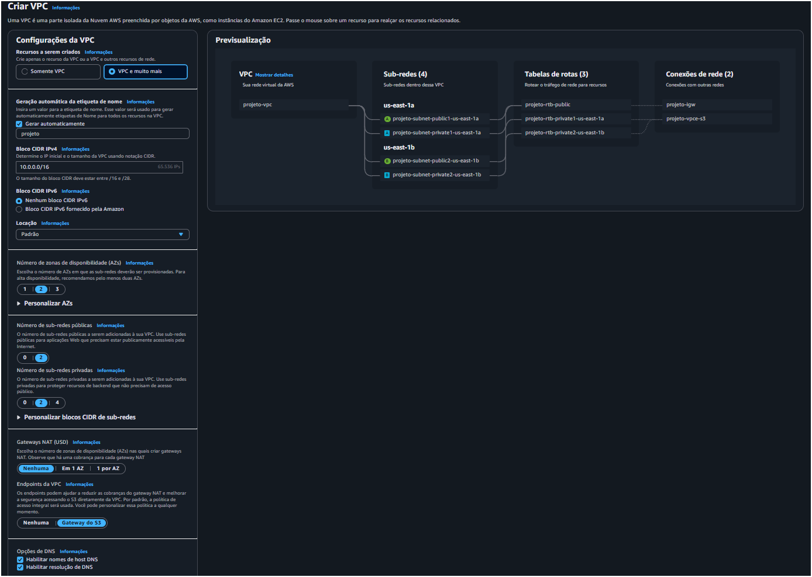
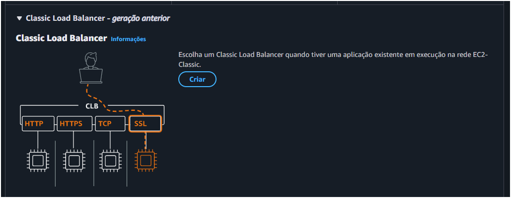
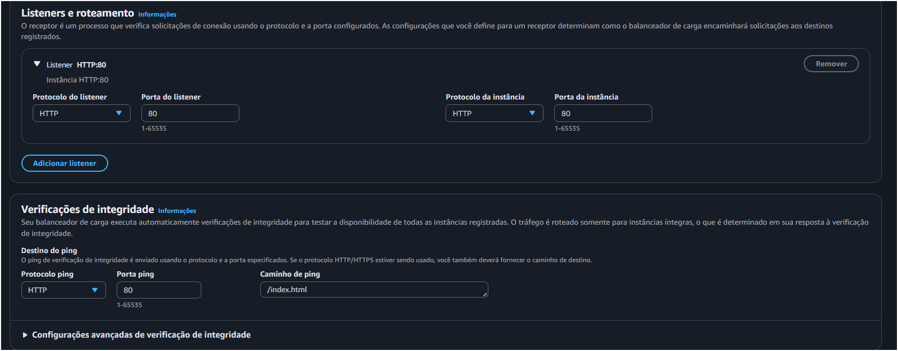
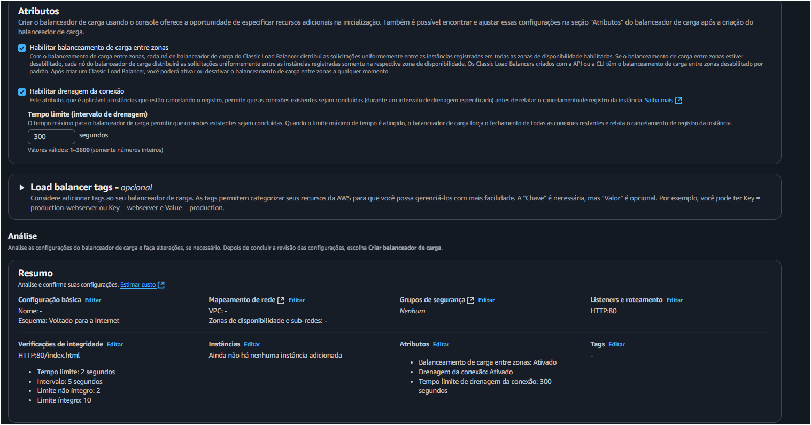
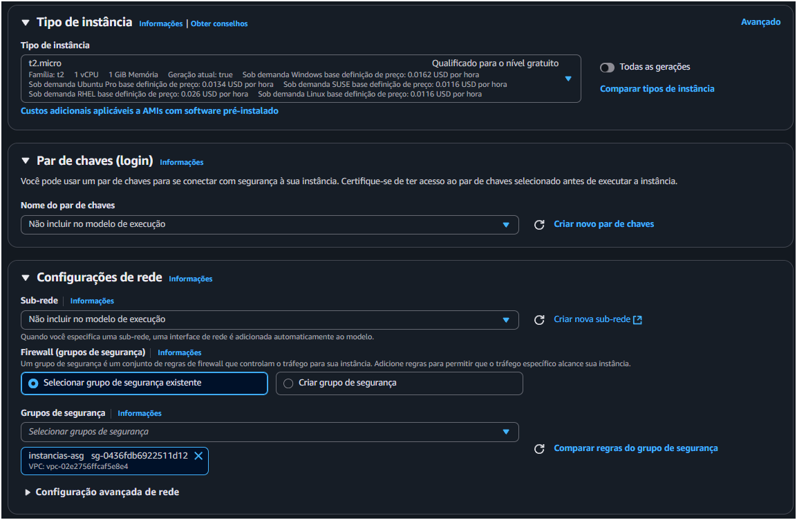
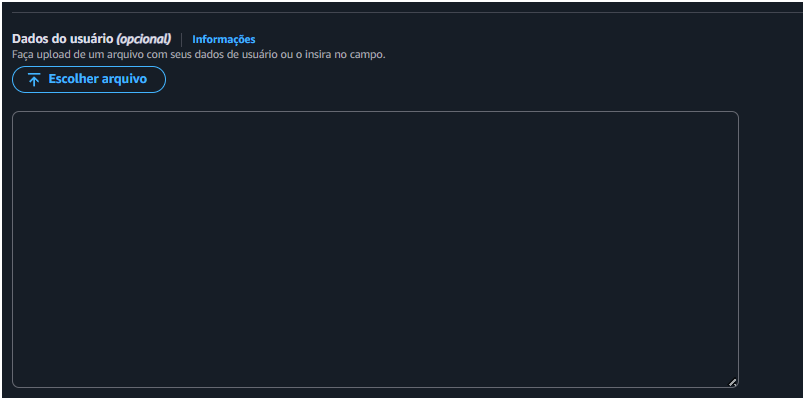

# Desafio Auto Scaling com Load Balancers

## Objetivo

O objetivo é criar uma infraestrutura que responda dinamicamente à carga de usuários, escalando instâncias EC2 conforme necessário usando Auto Scaling e Load Balancers.

---

## ✅ Passo 1: Criar a VPC

**Pesquise por VPC**
   - Vá em criar VPC
   - Abaixo as configurações para VPC





## ✅ Passo 2: Criar Load Balancer (CLB)

1. **Acesse o Console da EC2:**
   -  Navegue até o serviço EC2. No menu lateral á esquerda, Vá em  **Load Balancing**. 

2. **Inicie a Criação do Load Balancer:**
   - Clique no botão **Create Load Balancer**.
   - Selecione a opção **Classic Load Balancer** e clique em **Create**.


    


3. **Configuração Básica do Load Balancer:**
   - **Load Balancer name:** 
        Escolha um nome descritivo.

   - **Create LB inside:**
         Selecione a sua VPC padrão.

   - **Listener Configuration:** 
        protoclo do listener: `HTTP`
        Porta do listener:`80`.

    - **Verificações de integridade:** 
        Proctocolo ping: `HTTP`
        Porta ping: `80`.
        Caminho do ping: /index.html 


    

   
    Vião geral do Load Balancer

    


4. **Configuração de Segurança (Security Groups):**
   - Crie um grupo de segrurança
   - Adicione uma regra: **Inbound**
   - Selecione o protocolo:`HTTP`
   - Porta: `80`
   - Qualquer lugar: (`0.0.0.0/0`).

---

## ✅ Passo 2 e 3: Criar o Auto Scaling Group (ASG) com o Script de User Data

1. **Criar uma Launch Configuration (ou Launch Template):**

   - No menu da EC2, vá para **Auto Scaling** > **Launch Configurations**.
   - Clique em **Create launch configuration**.

   - **AMI:** 
        Escolha **Amazon Linux 2 AMI**.

   - **Instance type:** 
        Selecione `t2.micro`.

   - **Name:**
        Dê um nome.


    


2. **Configurações Adicionais:**
   - **User  data:** Na seção de detalhes avançados, selecione "As text" e cole o script.sh


   


   
   - **Explicação do Script:**
     - O script atualiza o sistema, instala o servidor Apache (`httpd`)
     -inicia o serviço e o configura para iniciar automaticamente com o sistema.
     - Cria um arquivo `index.html` para a verificação de saúde.
     - Cria um script CGI que simula uma carga de trabalho ao responder a requisições com um atraso de 5 segundos.

3. **Configuração de Segurança (Security Group):**
   - Crie um novo security group
   - Adicione regras **Inbound**:
     - `SSH` (porta 22) do seu IP (para diagnóstico, se necessário).

     - `HTTP` (porta 80) **apenas do security group do seu CLB**. 
     
     

4. **Criar o Auto Scaling Group:**
   - **Group name:** 
       Dê um nome para o grupo de segurança.   

   - **Launch Template:** 
        Selecione a que você acabou de criar.

     

   - **Network:** 
        Selecione a mesma VPC e as mesmas subnets que você usou para o CLB.

     

   - **Load Balancing:** 
        Marque **Receive traffic from one or more load balancers** e selecione o grupo de segurança criado.


   

   - **Health Check Type:** 
        Marque **ELB**.

   


5. **Configurar o Tamanho do Grupo:**
   - **Desired capacity:** `1` (começar com 1 instância).
   - **Minimum capacity:** `1` (minimo de instância que precisa ter)
   - **Maximum capacity:** `3` (maximo de instância que pode ser executada)

   

**Como Verificar:** 
    - Após alguns minutos, vá para **EC2 > Instances**. 
    - Você verá uma nova instância sendo iniciada.
    - Após ela estiver `running` acesse `http://<DNS_DO_CLB>/cgi-bin/teste`.

---

## ✅ Passo 4: Configurar as Regras de Escalonamento

1. **Acesse seu ASG:** Navegue até `EC2 > Auto Scaling Groups` e selecione `meu-asg-desafio`.

2. **Selecione a Aba `Automatic scaling`.**

3. **Crie uma Política de Escalonamento Dinâmico:**

   - Clique em **Create dynamic scaling policy**.
   - **Policy type:** Selecione `Simple scaling`.
   


### ➕ Regra para Aumentar (Scale Out)

- **Scaling policy name:** 
    Dê um nome á politica

- **CloudWatch alarm:**
    Clique em **Create a CloudWatch alarm**.

- **Metric name:**    
    A métrica do CLB é `RequestCount`.

- **Statistic:** 
    Selecione `Sum`.

- **Period:**
   Defina como `1 Minute`.

- **Condição:** 
    `Whenever RequestCount is Greater/Equal (>=) than 10`.

- **Importante:** 
        A métrica `RequestCount` representa o total de requisições no CLB no período. Se você tem 1 instância e a regra é `>= 10`, significa que mais de 10 requisições por minuto no CLB inteiro acionarão a regra. Se tivesse 2 instâncias, o total precisaria ser `> 20` para a média por instância ser `> 10`.

- **Take the action:** 
    Selecione `Add 1 instances`.

- **Cooldown:** 
    Deixe o padrão (`300` segundos).


### ➖ Regra para Diminuir 


- Repita o processo para criar outra política.
- **Scaling policy name:**
     Dê um nome, como `Diminuir-Grupo`.

- **CloudWatch alarm:** 
    Crie um novo alarme.

- **Metric name:** 
    `RequestCount` (a mesma).

- **Statistic:** 
    `Sum`.

- **Period:** 
    Defina como `5 Minutes` (use um período maior para diminuir, evitando ações agressivas).

- **Condição:** 
    `Whenever RequestCount is Less/Equal (<=) than 5`.

- **Take the action:**  
    Selecione `Remove 1 instances`.

---

## ✅ Passo 5: Testar o Auto Scaling

1. **Instale uma ferramenta de carga:**
   - Execute no linux: `sudo apt-get install hey`

2. **Execute o Teste de Carga:**
   - Pegue o **DNS Name** do seu CLB.
   - Abra seu terminal e execute o seguinte comando, substituindo `<DNS_DO_SEU_CLB>` pelo DNS do seu Load Balancer:

    ```bash
    hey -z 5m http://<DNS_DO_SEU_CLB>/cgi-bin/teste
    ```

3. **Monitore o Resultado:**

   - **CloudWatch Alarms:** 
        Vá para o console do CloudWatch. Você verá o alarme `OK` (verde) para `In alarm` (vermelho).

   - **ASG Activity History:** 
        Na aba **Activity** do seu ASG, você verá um evento aparecer indicando que uma nova instância foi adicionada.
    
   - **EC2 Instances:** 
        Na tela de instâncias EC2, você verá uma segunda (e talvez uma terceira) instância sendo provisionada (`pending`, depois `running`).

   - **CLB Instances:**
        Na aba **Instances** do seu CLB, você verá as novas instâncias sendo registradas e, após passarem no health check, entrarem no estado `InService`.

---


